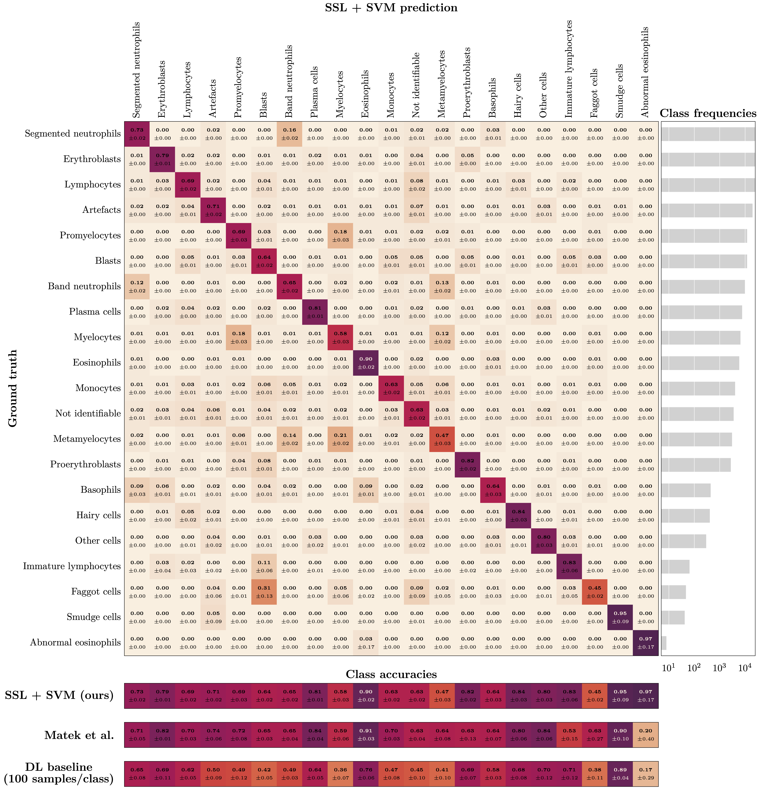

# Sparsam: Deep Learning on SPARSely Annotated Medical-data

*The name of the repository comes from the German word "[sparsam](https://en.wiktionary.org/wiki/sparsam)" [ˈʃpaːɐ̯zaːm], meaning "economical" or "sparing", which reflects the key feature of our approach regarding annotated samples for medical image data.*

This repository contains the code and data splits used in the experiments described in the publication titled "[Self-Supervision for Medical Image Classification](https://arxiv.org/abs/2304.05163)". The corresponding [results](#results) demonstrate that the utilized self-supervised learning method ([DINO](https://arxiv.org/abs/2104.14294)), in combination with an SVM, consistently outperforms supervised learning approaches (DL baseline). Furthermore, this method requires only a fraction of labeled training data to achieve state-of-the-art performance for medical image data classification. We encourage other researchers and practitioners to employ our approach and report the results achieved when utilizing it in their own experiments. By doing so, we can continue to build on this important work and advance the field of medical image classification **together**.

Our [reimplementation of DINO](https://github.com/facebookresearch/dino) is based on the work of Caron et al. from [Meta Research](https://research.facebook.com/).

In the future, we plan to extend our benchmarks and provide data splits for additional medical datasets and methods. This will allow researchers to evaluate and compare the effectiveness of various methods more comprehensively.

## Features
- Ready-to-use reimplementation of the DINO algorithm
  - Easy evaluation of new datasets
  - Reproducibility of our results
- Customizable classes for training student-teacher setups with various architectures
- Train-test splits for all datasets for future work and reproducibility
- Standardized supervised pipeline for baselining and hyperparameter tuning

## How to use
Clone the repository to your local machine:
```bash
git clone https://github.com/IPMI-ICNS-UKE/sparsam.git
```

Install the package and necessary dependencies:
```bash
pip install -e sparsam
pip install -r sparsam/requirements.txt
```

For custom use we provide an example python script (dino_example.py) which can be easily adapted to use DINO on own data. Note that an individual data set is required and cannot be provided for individual data.
```python
import sparsam
```

To reproduce the results of our paper, please follow the steps in the respective [readme file](https://github.com/IPMI-ICNS-UKE/sparsam/tree/master/reproducability).

Install the necessary dependencies:
## Data sets

The following data sets were used in this study:

- **Bone Marrow (BM) data set:** A highly unbalanced data set of single bone marrow cell microscopy images that can be found [here](https://wiki.cancerimagingarchive.net/pages/viewpage.action?pageId=101941770) and is provided by [Matek et al. (2021)](https://doi.org/10.1182/blood.2020010568).
- **Endoscopic (Endo) image data set:** The so-called HyperKvasir data set, consisting of labeled and unlabeled endoscopic images of the upper and lower gastrointestinal tract that can be found [here](https://datasets.simula.no/hyper-kvasir/) and is provided by [Borgli et al. (2020)](https://doi.org/10.1038/s41597-020-00622-y).
- **Dermoscopic lesion (ISIC) data set:**  A collection of dermoscopic skin lesion data sets that were released as part of the annual Grand Challenges organized by the International Skin Lesion Collaboration (ISIC, used data is from 2019 and 2020) that can be found [here](https://challenge.isic-archive.com/data/#2019)(2019) and [here](https://challenge.isic-archive.com/data/#2020)(2020).

For each data set, the trained XCiT small model weights are provided and can be used in the following way:
```python
import timm
model = timm.models.xcit_small_p8_224(in_chans=3, num_classes=0, pretrained=True)
```

## Results
In the following, main results of the performed experiments are presented. It can be seen that our proposed method is able to consitently outperform supervised learning approaches (DL baseline) and further only needs a fraction of labeled training data to achieve state-of-the-art performance. 


*Figure 1: Classification balanced accuracy for the different classifiers for different numbers of labeled samples per class for the three image data sets (BM, Endo, ISIC). The accuracy is shown for the maximum number of labeled training samples per class; if the training data set for a particular class contained only a smaller number of images, all available training images were used. This means that the training for larger sample sizes is partially biased toward better performance for larger classes due to the unavailability of a sufficient number of labeled training samples for smaller classes. The literature benchmark performance refers to accuracy data reported in the context of the publication of the image data sets (BM, Endo) and a directly associated publication for ISIC; average accuracy of the 14 models evaluated in the paper). The DL benchmark line indicates the performance of our DL baseline model trained on all available labeled samples of the training data sets.*


*Figure 2: See caption of fig. 1. Here, the experiments were restricted to classes with more than 250 labeled training samples.*


*Figure 3: Top: Confusion matrix for bone marrow (BM) image classification using the proposed workflow (i.e., SSL and subsequent classification with a standard ML classifier) with SVM training based on only 100 labeled images per class. The class frequencies are shown on the right. Bottom: Comparison of diagonal elements of the proposed approach (SSL + SVM), the benchmark data reported by Matek et al., and our DL baseline model when trained on only 100 labeled images per class. Please note that it is possible to zoom into the digital version of the figure for full readability of the details.*
