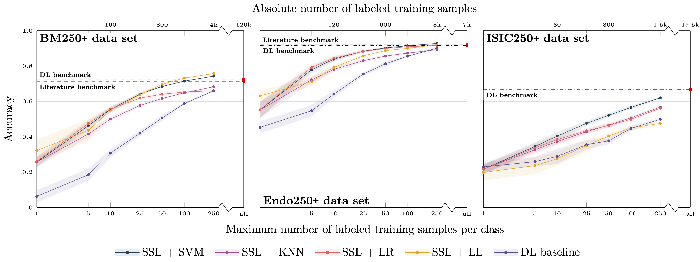

# Sparsam: Deep Learning on SPARSely Annotated Medical-data

*The name of the repository comes from the German word "[sparsam](https://en.wiktionary.org/wiki/sparsam)" [ˈʃpaːɐ̯zaːm], meaning "economical" or "sparing", which reflects the key feature of our approach regarding annotated samples for medical image data.*

This repository is a placeholder for the code and data used in the experiments described in the corresponding publication: "Self-supervision for medical image classification". Please note that the code and data will only be made available after the publication has been accepted. We appreciate your understanding in this matter. Once the publication has been accepted, we will update this repository with the necessary code and data to reproduce the experiments. Until then, solely additional information regarding model training and implementation details will be provided here. 

## Data sets

The following data sets were used in this study:

- **Bone Marrow (BM) data set:** A highly unbalanced data set of single bone marrow cell microscopy images that can be found [here](example.com/dataset1) and is provided by [Matek et al. (2021)](https://doi.org/10.1182/blood.2020010568).
- **Endoscopic (Endo) image data set:** The so-called HyperKvasir data set, consisting of labeled and unlabeled endoscopic images of the upper and lower gastrointestinal tract that can be found [here](example.com/dataset2) and is provided by [Borgli et al. (2020)](https://doi.org/10.1038/s41597-020-00622-y).
- **Dermoscopic lesion (ISIC) data set:**  A collection of dermoscopic skin lesion data sets that were released as part of the annual Grand Challenges organized by the International Skin Lesion Collaboration (ISIC) that can be found [here](example.com/dataset3) (provided by ).

## Results
In the following, main results of the performed experiments are presented. 

*Figure 1: Classification balanced accuracy for the different classifiers for different numbers of labeled samples per class for the three image data sets (BM, Endo, ISIC). The accuracy is shown for the maximum number of labeled training samples per class; if the training data set for a particular class contained only a smaller number of images, all available training images were used. This means that the training for larger sample sizes is partially biased toward better performance for larger classes due to the unavailability of a sufficient number of labeled training samples for smaller classes. The literature benchmark performance refers to accuracy data reported in the context of the publication of the image data sets (BM, Endo) and a directly associated publication for ISIC; average accuracy of the 14 models evaluated in the paper). The DL benchmark line indicates the performance of our DL baseline model trained on all available labeled samples of the training data sets.*

*Figure 2: See caption of fig. 1. Here, the experiments were restricted to classes with more than 250 labeled training samples.*

*Figure 3: Top: Confusion matrix for bone marrow (BM) image classification using the proposed workflow (i.e., SSL and subsequent classification with a standard ML classifier) with SVM training based on only 100 labeled images per class. The class frequencies are shown on the right. Bottom: Comparison of diagonal elements of the proposed approach (SSL + SVM), the benchmark data reported by Matek et al., and our DL baseline model when trained on only 100 labeled images per class. Please note that it is possible to zoom into the digital version of the figure for full readability of the details.*
